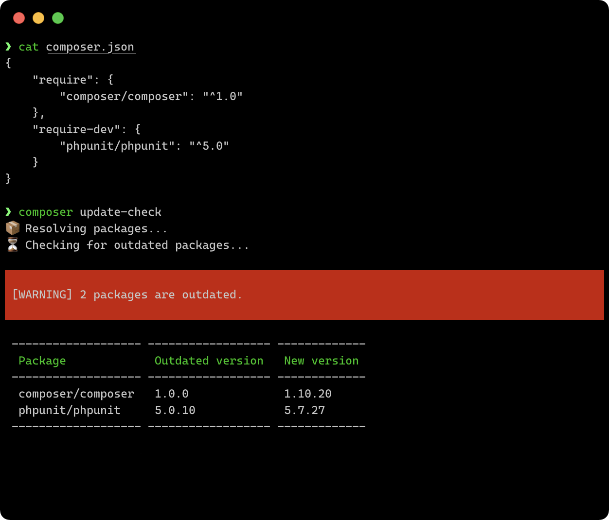
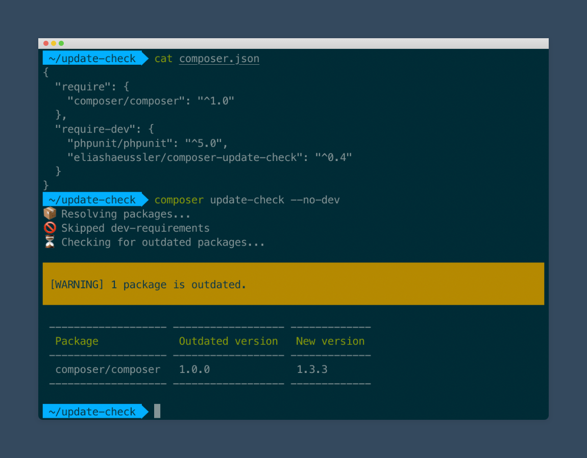
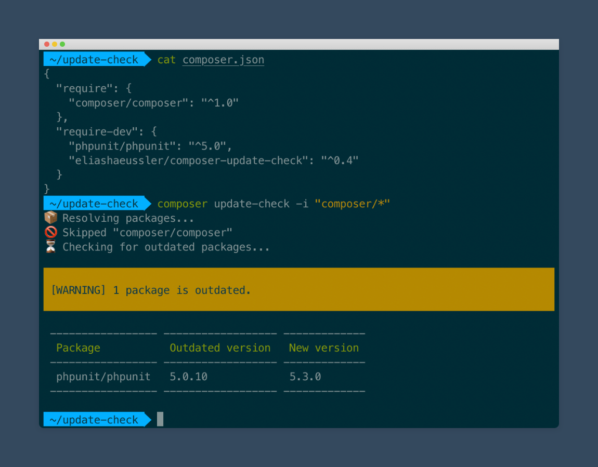
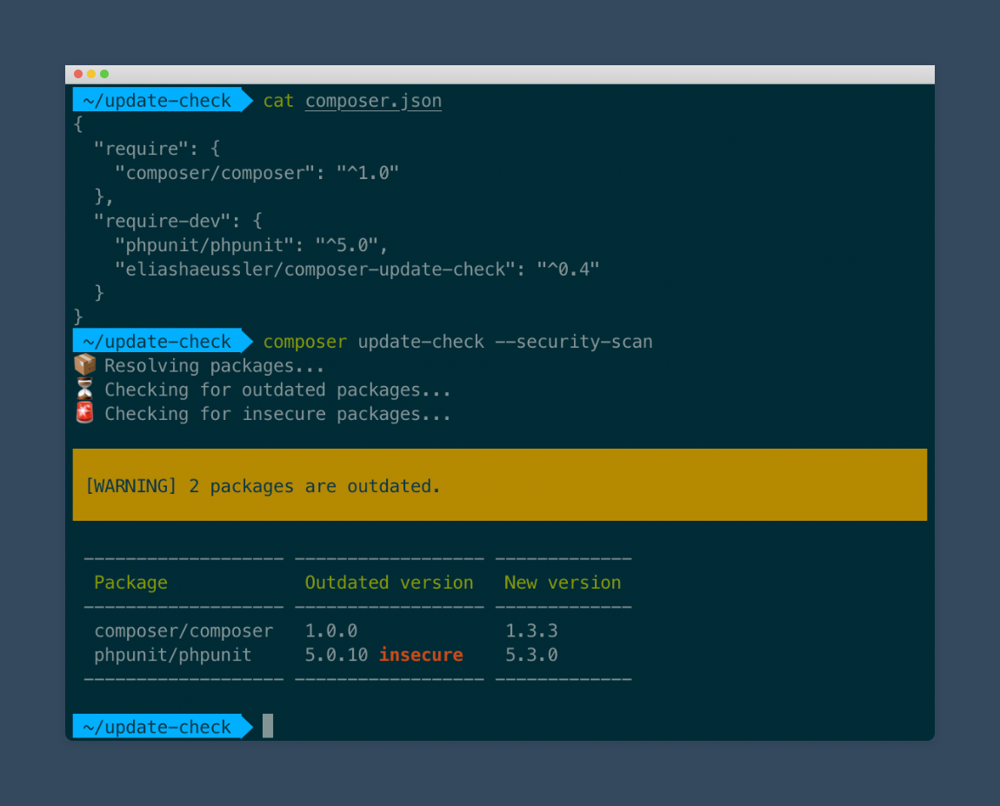
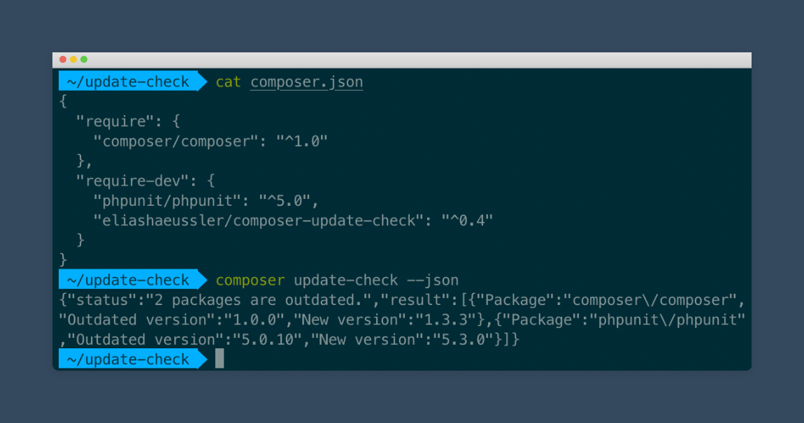

# Features

## Base check

The main feature is about checking whether all **root requirements** are
**up to date**. This is achieved by internally performing a simple
`composer update` as dry run and evaluating the result.

Using the native Composer command allows to **fully respect all Composer
configuration**. This ensures that the displayed results are as reasonable
as possible.

### Command

```bash
composer update-check
```

[:octicons-link-external-16: Reference](usage.md#command-line-usage){: target=_blank }

### Example



## Without dev-packages

In case **only packages listed in `require`** should be checked, the option
`--no-dev` can be used. It skips all packages listed in `require-dev` by
excluding them from the list of packages internally passed to `composer update`.

Note that packages are still checked if they are listed in the `require`
section as well. To completely exclude a specific package, the
[`--ignore-packages` parameter](#blacklisted-packages) might be the better
choice.

### Command

```bash
composer update-check --no-dev
```

[:octicons-link-external-16: Reference](usage.md#-no-dev){: target=_blank }

### Example



## Blacklisted packages

Specific packages can be explicitly excluded from the update check. This can
be done by either specifying the full package name or using an asterisk as
placeholder, e.g. `my-vendor/*`.

All packages are internally parsed using the native PHP function
[`fnmatch`](https://www.php.net/manual/de/function.fnmatch.php) to check
whether they should be excluded from the update check.

!!! tip
    Multiple packages can be excluded at the same time as the `-i` parameter
    can be used repeatedly.

### Command

```bash
composer update-check -i "composer/*"
```

[:octicons-link-external-16: Reference](usage.md#-ignore-packages-i){: target=_blank }

### Example



## Security scan

Since version 0.3.0 of the Plugin an additional security scan can be
performed to check whether currently required package versions are
insecure. This can especially be useful if frameworks are used which
are regularly updated.

The security scan is being performed using the Composer package
[sensiolabs/security-checker](https://packagist.org/packages/sensiolabs/security-checker).
For this, the `composer.lock` file is passed to the external Symfony
scan service.

### Command

```bash
composer update-check --security-scan
```

[:octicons-link-external-16: Reference](usage.md#-security-scan-s){: target=_blank }

### Example



## JSON output

As an alternative output, the update check result can also be printed in
JSON format. This might be useful when using the update check as basis for
other tools or programs.

!!! hint
    If you want to use the update check result for additional reports,
    you might be interested in the
    [`PostUpdateCheckEvent`](https://gitlab.elias-haeussler.de/eliashaeussler/composer-update-check/-/blob/master/src/Event/PostUpdateCheckEvent.php)
    which is being dispatched after each successfull update check.

### Command

```bash
composer update-check --json
```

[:octicons-link-external-16: Reference](usage.md#-json-j){: target=_blank }

### Example


