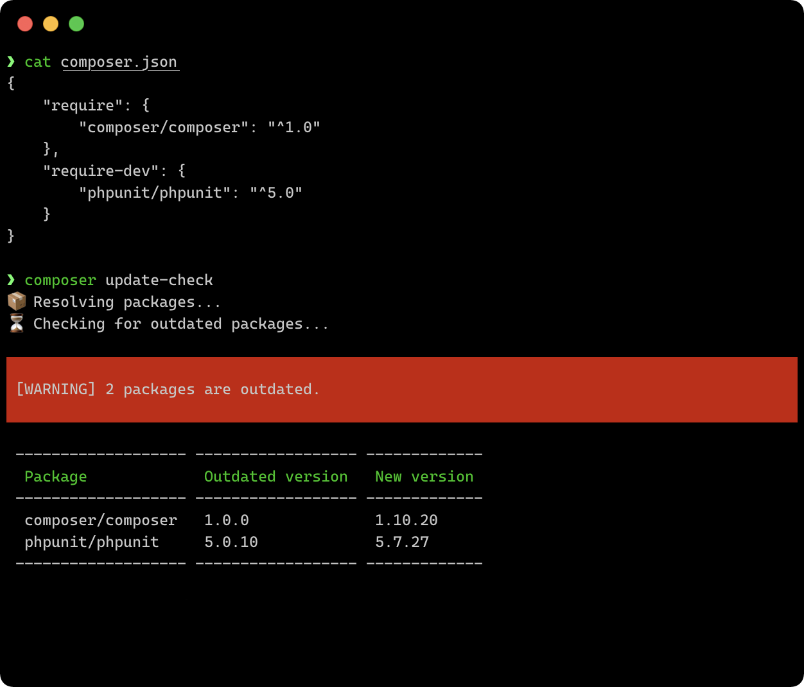
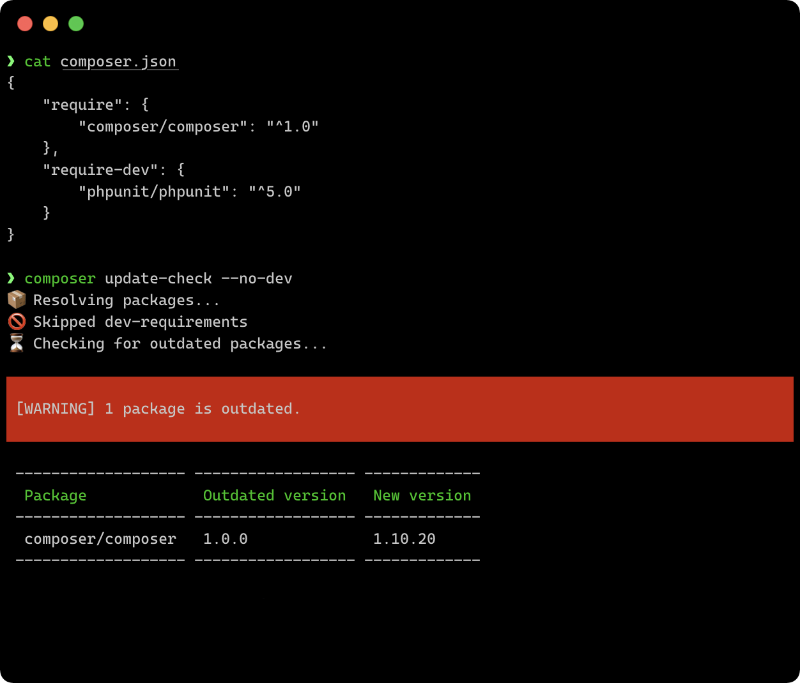
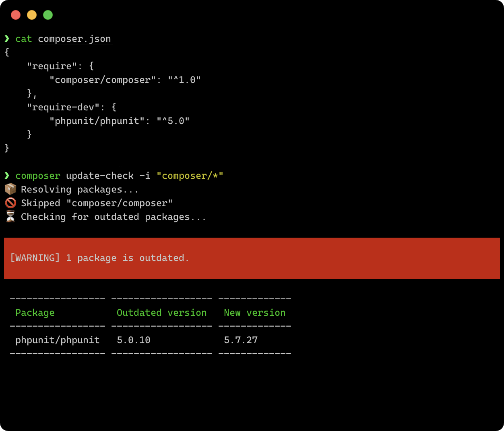
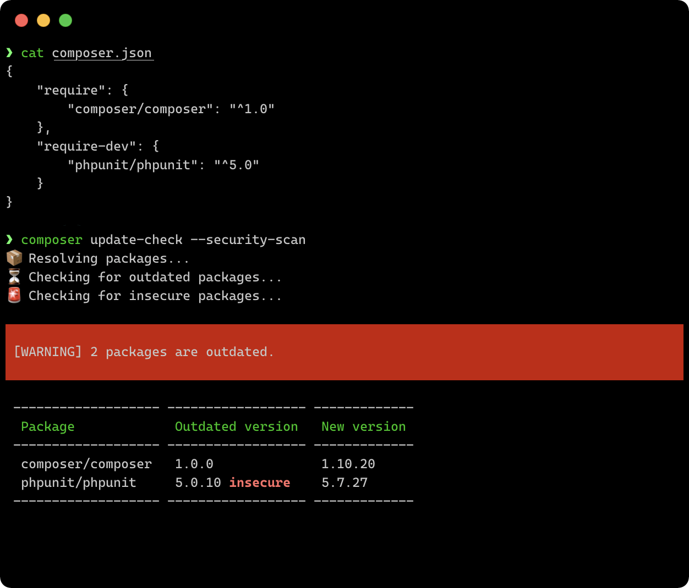
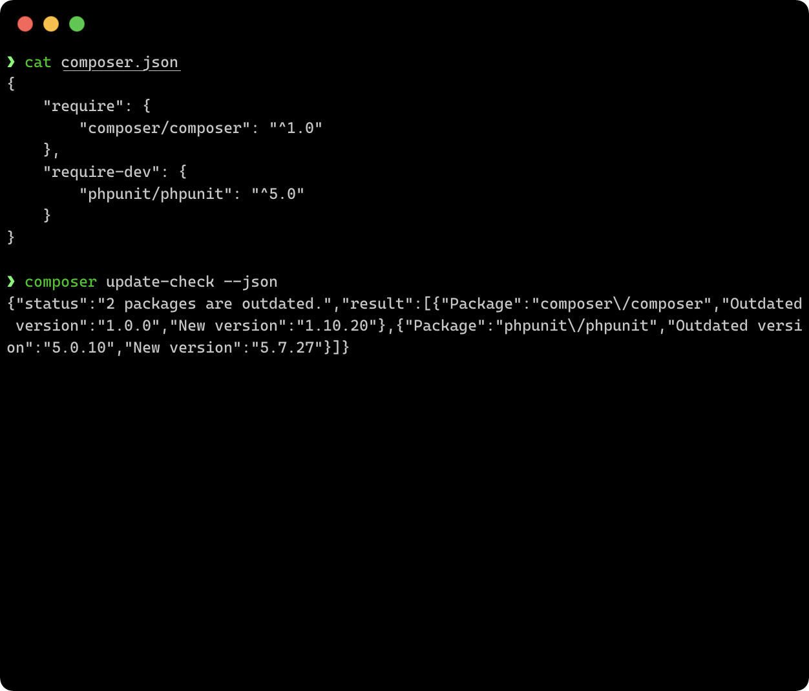

# Features

## :mag_right: Base check

```bash
composer update-check
```

[:octicons-link-external-16: Reference](usage.md){: target=_blank }

The main feature is about checking whether all **root requirements** are
**up to date**. This is achieved by internally performing a simple
`composer update` as dry run and evaluating the result.

Using the native Composer command allows to **fully respect all Composer
configuration**. This ensures that the displayed results are as reasonable
as possible.



## :no_entry_sign: Exclude dev-packages

```bash
composer update-check --no-dev
```

[:octicons-link-external-16: Reference](usage.md#-no-dev){: target=_blank }

In case **only packages listed in `require`** should be checked, the option
`--no-dev` can be used. It skips all packages listed in `require-dev` by
excluding them from the list of packages internally passed to `composer update`.

Note that packages are still checked if they are listed in the `require`
section as well. To completely exclude a specific package, the
[`--ignore-packages` parameter](#exclude-by-name-or-pattern) might be the better
choice.



## :material-regex: Exclude by name or pattern

!!! tip
    Multiple packages can be excluded at the same time since the `-i` parameter
    can be used repeatedly.

```bash
composer update-check -i "composer/*"
```

[:octicons-link-external-16: Reference](usage.md#-ignore-packages-i){: target=_blank }

**Specific packages** can be explicitly excluded from the update check. This
can be done by either specifying the **full package name** or using an asterisk
as **placeholder**, e.g. `my-vendor/*`.

All packages are internally parsed using the native PHP function
[`fnmatch`](https://www.php.net/manual/de/function.fnmatch.php) to check
whether they should be excluded from the update check.



## :material-security: Security scan

```bash
composer update-check --security-scan
```

[:octicons-link-external-16: Reference](usage.md#-security-scan-s){: target=_blank }

Since version 0.3.0 of the Plugin an **additional security scan** can
be performed to check whether currently required package versions are
**insecure**. This can especially be useful if frameworks are used which
are regularly updated.

The security scan is being performed by the help of the
[Packagist Security Advisories API endpoint](https://packagist.org/apidoc#list-security-advisories).



## :material-code-json: JSON output

```bash
composer update-check --json
```

[:octicons-link-external-16: Reference](usage.md#-json-j){: target=_blank }

As an **alternative output**, the update check result can also be printed in
**JSON format**. This might be useful when using the update check as basis for
other tools or programs.

If you want to use the update check result for additional reports,  you might
be interested in the [`PostUpdateCheckEvent`](events.md#postupdatecheckevent)
which is being dispatched after each successful update check.


