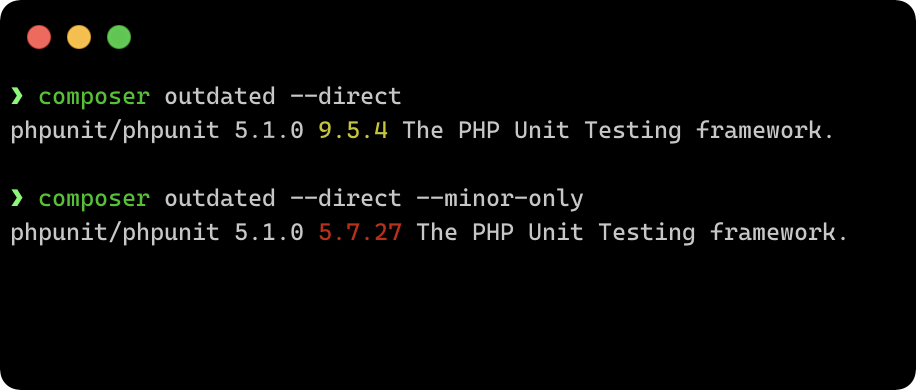
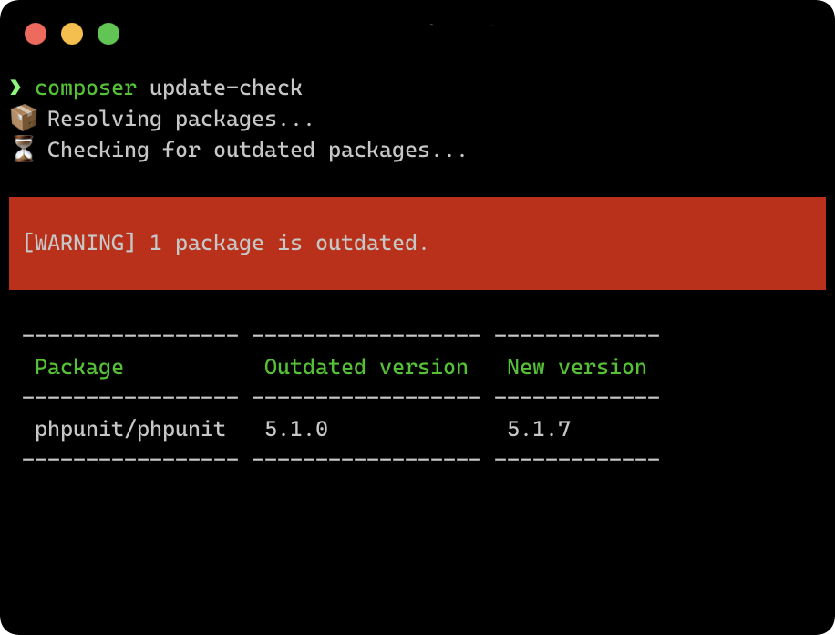

---
hide:
- toc
---

[]({{ repository.url }}/-/pipelines)
[]({{ repository.url }}/-/pipelines)
[](https://packagist.org/packages/eliashaeussler/composer-update-check)
[](https://hub.docker.com/r/eliashaeussler/composer-update-check)
[](license.md)

# Composer update check plugin

> A Composer Plugin to check outdated packages, based on their requirements.

## :rocket: Features

* [x] Find outdated packages<br>
* [x] Multiple exclusion patterns (ignore packages, skip dev-requirements)<br>
* [x] Optional security scan<br>
* [x] Allow integration of additional plugins

## :hatched_chick: What are the differences to other plugins and commands?

Against other plugins and commands, this Plugin takes the **version constraints**
into account and reports outdated packages based on the individual **requirements**
in your `composer.json` file.

### Example

Given the following requirements of a `composer.json` file:

```json
{
  "require-dev": {
    "phpunit/phpunit": "~5.1.0"
  }
}
```

Now compare the output of the native `composer outdated` command with
the output from the `composer update-check` command provided by this plugin:

=== "Composer"

    { width=500 align=right }

    Using the native Composer command `composer outdated`, one can only check
    if major or minor version updates are available.

    In this case the command output would either show the major update (currently version
    `9.x.x`) or the minor update (currently version `5.7.x`).

    [:octicons-link-external-16: Reference](https://getcomposer.org/doc/03-cli.md#outdated){: target=_blank }


=== "Update check plugin"

    { width=500 align=right }
    
    The Composer command `composer update-check` provided by this plugin allows
    checking for version updates based on the exact requirements. In this case
    the output would show an available update to version `5.1.7`.
    
    This is basically the same result one would get when running
    `composer update --root-reqs --dry-run`.

    Additionally, one can explicitly exclude several packages from being checked
    for available updates or perform an additional security scan for the currently
    installed package versions.
    
    [Let's get started :material-arrow-right:](install.md)

## :star: License

This project is licensed under
[GNU General Public License 3.0 (or later)](license.md).
